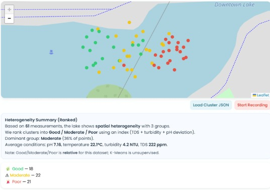

# WARTEQ: ML-Based Spatial Clustering for Lake Water Quality Monitoring

## Overview
**WARTEQ** is an IoT-enabled RC boat system designed for spatial water-quality monitoring across lakes and freshwater bodies. By deploying an unsupervised machine learning pipeline (K-Means Clustering) on in-situ sensor data, the system identifies spatial heterogeneity and categorizes water regions into relative quality zones (Good, Moderate, Poor).

📄 **[Read the Full ML Paper (PDF)](./docs/WARTEQ_ML_Final_Paper.pdf)**

---

## Key Features
* **Mobile Sensing Platform:** ESP32-powered RC boat equipped with pH, Temperature, Turbidity, TDS sensors, and GPS positioning.
* **Real-Time Telemetry:** WiFi and MQTT communication layer connected to a Firebase Realtime Database.
* **Unsupervised ML Pipeline:** K-Means clustering ($k=3$) trained on logarithmic-transformed and Z-score normalized sensor vectors.
* **Client-Side Edge Inference:** Browser-based JavaScript implementation running pretrained K-Means cluster centroids and scaling parameters directly on the web dashboard.

---

## Technical Specifications & Architecture

### Machine Learning Model
| Parameter | Specification / Detail |
| :--- | :--- |
| **Algorithm** | K-Means Clustering ($k=3$, evaluated via Elbow Method, Silhouette, & Davies-Bouldin) |
| **Feature Vector (6D)** | `[pH, Temp, Turb, TDS, log1p(Turb), log1p(TDS)]` |
| **Preprocessing** | Z-Score Normalization (`StandardScaler`) + Logarithmic Skew Reduction |
| **Dimensionality Reduction** | Principal Component Analysis (PCA) 2D Projection |

### Hardware & Electronics Stack
* **Microcontroller:** ESP32 DEVKIT V4
* **Sensors:** Analog pH Sensor (PH-4502C), SEN-0175 Turbidity Sensor, TDS Meter V1.0, DS18B20 Temperature Probe, NEO-6M GPS Module
* **Actuation & Drive:** BTS7960 Motor Driver, DC Motor, Servo Motor (Rudder Steering)

---

## Security & Secrets Setup

> **Note:** API keys and Wi-Fi credentials have been scrubbed from this repository for security.

To connect your own telemetry backend:
1. Update `firmware/boat_receiver.ino` with your local Wi-Fi SSID and Password.
2. Configure your Firebase Realtime Database keys in `web/index.html`.

---

## Authors & Team
* **5 Binus ASO School of Engineering Students**
